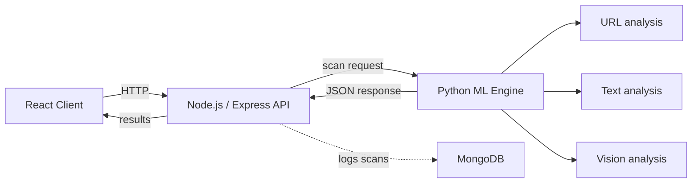

# PhishGuard
### ML-powered phishing detection across URLs, text, and screenshots


PhishGuard is a full-stack phishing detection system that evaluates:

- suspicious URLs
- phishing-style text and emails
- webpage screenshots and pasted browser captures

The project uses a React frontend, an Express API, and a Python ML engine.

---

## Overview

Phishing attacks rarely depend on just one trick. Some rely on deceptive links, some on coercive language, and others on cloned login pages. PhishGuard uses a layered pipeline so each scanner can contribute explainable evidence instead of only returning a black-box verdict.

---

## Detection Modules

| Module | Core approach | What it checks |
| :--- | :--- | :--- |
| URL Analysis | Scikit-learn + lexical heuristics | host shape, suspicious tokens, brand lookalikes, entropy, risky TLDs, fallback heuristic scoring |
| Text and Email | TF-IDF model + phishing-aware heuristics | urgency, credential requests, account threats, payment lures, reward lures, conversational safe overrides |
| Vision Scanner | OCR + layout cues + brand/domain checks | visible domains, login wording, payment fields, threat language, form-like regions, brand/domain mismatch |

---

## Why the architecture is layered

- The URL scanner keeps working even when the serialized model is uncertain by applying a heuristic risk floor for obviously suspicious links.
- The text scanner reduces false positives by recognizing benign conversational messages and then layering phishing-specific signals on top.
- The vision scanner does not depend only on logos. It reads screenshot text, looks for form cues, and checks whether the visible brand matches the supplied domain.

---

## System Architecture



---

## Local Setup

### Prerequisites

- Node.js 18+
- Python 3.11+
- MongoDB

### 1. Start the Python ML engine

```bash
cd ml_engine
python -m pip install -r requirements.txt
python app.py
```

The ML engine runs on `http://localhost:5001`.

### 2. Start the backend

```bash
cd server
npm install
npm start
```

The API runs on `http://localhost:5000`.

### 3. Start the frontend

```bash
cd client
npm install
npm run dev
```

The UI runs on `http://localhost:5173`.

---

## Notes

- Screenshot scanning supports image upload and direct paste from the clipboard.
- Vision results are explainable and include OCR preview, form cues, and detected indicators.
- The frontend can be pointed at a different backend with `VITE_API_BASE_URL`.

---

## Roadmap

- Browser extension support
- Better scan history and case review workflow
- More benchmark screenshots for branded login flows
- Cleaner deployment story for the Express API and ML engine

---

## Authors

- Revan Midha
- Utkarsh Singh
- Simarpreet Singh
- Dushyant Saini
