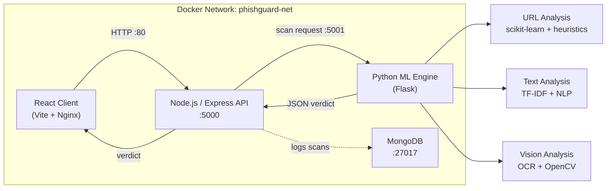

# PhishGuard
### ML-powered phishing detection across URLs, text, and screenshots


PhishGuard is a full-stack, containerized phishing detection platform that evaluates:

- **Suspicious URLs** — structural analysis, brand lookalikes, risky TLDs
- **Phishing text and emails** — social engineering signals, urgency, credential harvesting
- **Webpage screenshots** — OCR-based analysis, visual clone detection

---

## Table of Contents

- [Overview](#overview)
- [Detection Modules](#detection-modules)
- [System Architecture](#system-architecture)
- [Project Structure](#project-structure)
- [Docker Setup (Recommended)](#docker-setup-recommended)
- [Local Setup (Without Docker)](#local-setup-without-docker)
- [CI/CD Pipeline](#cicd-pipeline)
- [API Reference](#api-reference)
- [Test Cases](#test-cases)
- [Authors](#authors)

---

## Overview

Phishing attacks rarely depend on just one trick. Some rely on deceptive links, some on coercive language, and others on cloned login pages. PhishGuard uses a **layered 3-engine pipeline** so each scanner contributes explainable evidence instead of returning a black-box verdict.

---

## Detection Modules

| Module | Core Approach | What it Checks |
|:---|:---|:---|
| **URL Scanner** | Scikit-learn + lexical heuristics | Host shape, suspicious tokens, brand lookalikes, entropy, risky TLDs, heuristic fallback scoring |
| **Text & Email Scanner** | TF-IDF model + phishing-aware NLP | Urgency, credential requests, account threats, financial lures, reward lures, conversational safe overrides |
| **Vision Scanner** | Tesseract OCR + OpenCV + NLP | Visible domains, login wording, payment fields, threat language, form-like regions, brand/domain mismatch |

### Why the architecture is layered

- The **URL scanner** applies a heuristic risk floor for structurally suspicious links even when the ML model is uncertain.
- The **text scanner** reduces false positives by recognizing benign conversational messages before layering phishing-specific signals on top.
- The **vision scanner** does not depend only on logos. It reads screenshot text via OCR, looks for form cues, and checks whether the visible brand matches the supplied domain.

---

## System Architecture



---

## Project Structure

```
PhishGuard/
├── client/                  # React + Vite frontend
│   ├── src/
│   │   ├── pages/           # UrlScanner, TextScanner, VisionScanner, Dashboard
│   │   ├── components/      # Header, Sidebar, DashboardLayout
│   │   └── lib/             # scanUi.js (shared scan UI helpers)
│   └── Dockerfile           # Multi-stage Nginx production build
│
├── server/                  # Node.js + Express backend
│   ├── controllers/         # scanController.js, authController.js
│   ├── routes/              # scanRoutes, authRoutes, feedbackRoutes
│   ├── services/            # mlService.js (communicates with ML Engine)
│   ├── models/              # Scan.js, User.js
│   ├── config/              # db.js (MongoDB connection)
│   ├── .env.example         # Environment variable template
│   └── Dockerfile
│
├── ml_engine/               # Python Flask ML microservice
│   ├── urls/                # URL model + feature extractor
│   │   ├── url_model_utils.py
│   │   └── url_model_v2.pkl
│   ├── emails/              # Text/email phishing model
│   │   ├── text_scanner.py
│   │   └── text_model.pkl
│   ├── vision/              # Screenshot OCR + CV scanner
│   │   └── vision_scanner.py
│   ├── app.py               # Flask entrypoint (port 5001)
│   ├── requirements.txt
│   └── Dockerfile
│
├── mongo/                   # MongoDB container
│   └── Dockerfile
│
├── docker-compose.yml       # Orchestrates all 4 services
└── Jenkinsfile              # CI/CD pipeline definition
```

---

## Docker Setup (Recommended)

### Prerequisites

- [Docker Desktop](https://www.docker.com/products/docker-desktop/) installed and running

### 1. Clone the repository

```bash
git clone https://github.com/RevanMidha/PhishGuard.git
cd PhishGuard
```

### 2. Configure environment variables

```bash
cp server/.env.example server/.env
```

Edit `server/.env` with your actual values:

```env
PORT=5000
MONGO_URI=mongodb://mongo:27017/phishguard
JWT_SECRET=your_jwt_secret_here
```

### 3. Build and start all containers

```bash
docker compose -p phishguard up --build
```

| Service | URL |
|---|---|
| Frontend | http://localhost |
| Backend API | http://localhost:5000 |
| ML Engine | http://localhost:5001 |
| MongoDB | localhost:27017 |

### 4. Stop all containers

```bash
docker compose -p phishguard down
```

---

## Local Setup (Without Docker)

### Prerequisites

- Node.js 20+
- Python 3.11+
- MongoDB running locally

### 1. Start the Python ML Engine

```bash
cd ml_engine
pip install -r requirements.txt
python app.py
```

Runs on `http://localhost:5001`

### 2. Start the Backend

```bash
cd server
npm install
cp .env.example .env   # Edit MONGO_URI to mongodb://localhost:27017/phishguard
npm start
```

Runs on `http://localhost:5000`

### 3. Start the Frontend

```bash
cd client
npm install
npm run dev
```

Runs on `http://localhost:5173`

---

## CI/CD Pipeline

PhishGuard uses **Jenkins** for automated builds and deployments triggered on every push to `main`.

### Jenkins Pipeline Stages

```
Checkout Code → Stop Old Containers → Build MongoDB → Build ML Engine → Build Backend → Build Frontend → Clean Up Space
```

### Jenkinsfile

```groovy
pipeline {
    agent any
    stages {
        stage('Checkout Code') {
            steps {
                git branch: 'main', url: 'https://github.com/RevanMidha/PhishGuard.git'
            }
        }
        stage('Stop Old Containers') {
            steps {
                bat 'docker compose -p phishguard down'
            }
        }
        stage('Build MongoDB') {
            steps {
                bat 'docker compose -p phishguard up -d --build mongo'
            }
        }
        stage('Build ML Engine') {
            steps {
                bat 'docker compose -p phishguard up -d --build ml_engine'
            }
        }
        stage('Build Backend') {
            steps {
                bat 'docker compose -p phishguard up -d --build backend'
            }
        }
        stage('Build Frontend') {
            steps {
                bat 'docker compose -p phishguard up -d --build frontend'
            }
        }
        stage('Clean Up Space') {
            steps {
                bat 'docker image prune -f'
            }
        }
    }
}
```

---

## API Reference

### URL Scan
```http
POST /api/scan/url
Content-Type: application/json

{ "url": "https://example.com" }
```

### Text Scan
```http
POST /api/scan/text
Content-Type: application/json

{ "text": "Your account has been suspended. Click here immediately." }
```

### Vision Scan
```http
POST /api/scan/vision
Content-Type: application/json

{ "imageData": "<base64>", "url": "https://example.com" }
```

### Response Format
```json
{
  "result": "malicious",
  "confidence_score": 0.94,
  "threshold_used": 0.5,
  "indicators": [
    { "label": "Urgency pressure", "detail": "...", "severity": "high" }
  ]
}
```

---

## Test Cases

### URL Scanner

| Input | Expected |
|---|---|
| `https://google.com` | ✅ Safe |
| `https://github.com/login` | ✅ Safe |
| `http://paypal-verify.com` | 🟠 Suspicious |
| `http://192.168.1.1/bank/login` | 🔴 Malicious |
| `https://microsoft-account-suspended.xyz/reset-password` | 🔴 Malicious |

### Text Scanner

| Input | Expected |
|---|---|
| `Hey, how are you doing?` | ✅ Safe |
| `Your subscription is expiring soon. Click to renew.` | 🟠 Suspicious |
| `URGENT: Your PayPal account is suspended. Verify now at http://paypal-secure.tk` | 🔴 Malicious |
| `Enter your OTP and password to restore access. Act within 24 hours.` | 🔴 Malicious |

---

## Authors

- **Revan Midha**
- **Utkarsh Singh**
- **Simarpreet Singh**
- **Dushyant Saini**
