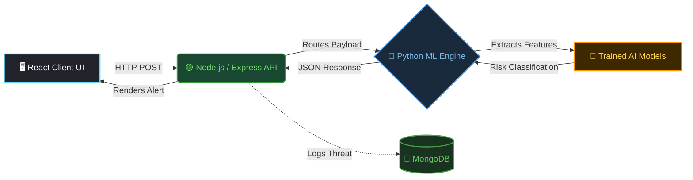

# 🛡️ PhishGuard
### Next-Generation ML-Powered Phishing Detection System


> Protecting users from credential theft and online fraud through AI-driven lexical analysis, Natural Language Processing, and Computer Vision.

---

## 📌 Overview

Phishing attacks exploit users through fake websites and deceptive social engineering. Traditional static rule-based systems cannot keep pace with modern, polymorphic phishing techniques that constantly evolve to bypass filters.

**PhishGuard** is a full-stack, machine learning cybersecurity framework that actively analyzes URLs, extracts textual context from webpages and emails, and visually inspects webpage screenshots to accurately classify and block phishing attempts in real time.

---

## 🎯 Objectives

| | Goal | Description |
|--|------|-------------|
| ⚡ | **Defend at the Edge** | Detect malicious URLs instantly using trained ML models before a user ever loads a page |
| 🧠 | **Understand Context** | Analyze webpage and email text using NLP to identify social engineering language and urgency cues |
| 👁️ | **See the Threat** | Identify brand impersonation and fake login pages through Computer Vision layout similarity scoring |
| 📦 | **Scale Securely** | Containerized microservice API architecture capable of real-time, high-volume detection |

---

## 🧠 Detection Modules

PhishGuard uses a three-layer detection pipeline, each targeting a different attack vector:

| Module | Technologies | Features Extracted |
| :--- | :--- | :--- |
| 🔗 **Lexical URL Analysis** | `Scikit-learn` `Pandas` | URL length, special character frequency, HTTPS presence, subdomain entropy |
| ✉️ **NLP Content Analysis** | `TF-IDF` `NLTK` | Tokenization, stopword removal, urgency & threat phrase classification |
| 👁️ **Computer Vision** | `TensorFlow` `OpenCV` | Webpage screenshot capture, CNN brand classification, visual layout similarity |

---

## 🏗️ System Architecture

PhishGuard uses a decoupled, containerized microservice architecture to cleanly separate the frontend, API layer, and ML engine.



**Data flow:**

1. The React UI sends a URL or email payload to the Node.js API via HTTP POST
2. Express routes the data to the Python ML Engine for feature extraction
3. All three detection modules run in parallel and return a consolidated risk classification
4. The result is surfaced as a real-time alert in the UI and logged to MongoDB

---

## 🚀 Getting Started

### Prerequisites

- [Git](https://git-scm.com/)
- [Node.js](https://nodejs.org/) v18 or higher
- [Python](https://python.org/) 3.9+ *(local setup only)*
- [Docker Desktop](https://www.docker.com/products/docker-desktop/) *(Docker setup only)*
- A running [MongoDB](https://www.mongodb.com/) instance

### 🐳 Option 1 — Docker Setup *(Recommended)*

```bash
# 1. Clone the repository
git clone https://github.com/RevanMidha/PhishGuard.git
cd PhishGuard

# 2. Build the Docker image
docker build -t phishguard .

# 3. Run the container
docker run -d -p 5000:5000 --name phishguard-container \
  -e MONGO_URI="mongodb://host.docker.internal:27017/phishguard" \
  -e JWT_SECRET="your_secret_here" \
  phishguard

# 4. Start the React frontend (open a new terminal)
cd client && npm install && npm run dev
```

> API → `http://localhost:5000` | UI → `http://localhost:5173`

### 💻 Option 2 — Local Developer Setup

```bash
# 1. Clone the repository
git clone https://github.com/RevanMidha/PhishGuard.git
cd PhishGuard

# 2. Start the Python ML Engine (Microservice)
cd ml_engine
python -m pip install -r requirements.txt
python app.py
# → ML Engine running at http://localhost:5001

# 3. Install and start the backend (open a new terminal)
cd server && npm install && npm start
# → Node API running at http://localhost:5000

# 4. Install and start the frontend (open a third terminal)
cd client && npm install && npm run dev
# → React UI running at http://localhost:5173
```

---

## 🔮 Roadmap

- [ ] **Dual-Container Docker-Compose** — Update the Docker architecture to orchestrate both the Node API and Python ML microservices concurrently
- [ ] **Browser Extension** — Chrome & Firefox integration to warn users before a page loads
- [ ] **Email Integration** — API hooks for scanning incoming IMAP/SMTP mail in real time
- [ ] **Live Traffic Dashboard** — Analytics panel for monitoring active threats across sessions
- [ ] **Cloud Deployment** — Migration of the containerized engine to AWS or GCP

---

## 👨‍💻 Authors

Built as a capstone project by:

| Name | Role |
| :--- | :--- |
| **Revan Midha** | Architecture & Full-Stack Development |
| **Utkarsh Singh** | ML Engineering |
| **Simarpreet Singh** | NLP & Data Pipeline |
| **Dushyant Saini** | Computer Vision |

---

<sub>Academic License · 2025</sub>
